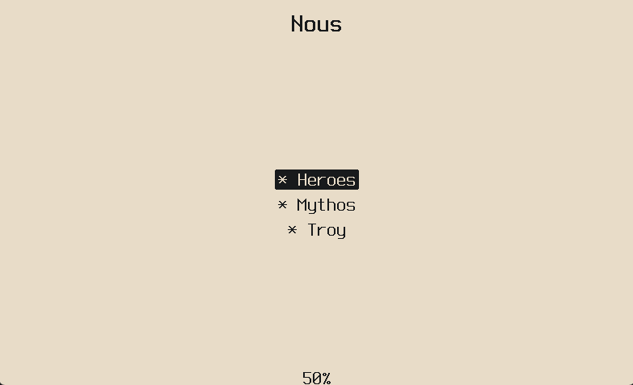
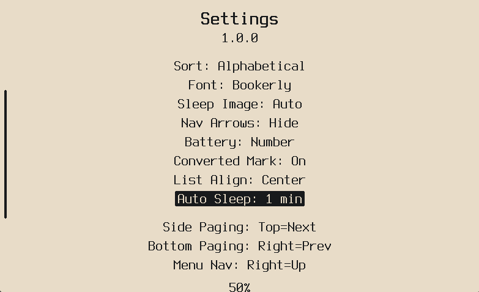
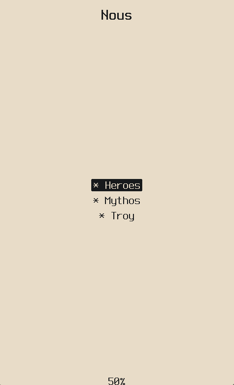

# Nous

Nous is my personal fork of [microreader](https://github.com/CidVonHighwind/microreader/) by [CidVonHighwind](https://github.com/CidVonHighwind) — an open-source EPUB reader firmware for the Xteink X4 e-ink device.

microreader is great at what it does. This fork adds the things I personally wanted on top of it, without changing what makes it good.

> **v1.0.1** · Based on microreader 2.0-dev · GPL v2

---

## What Nous adds

| Feature | Description |
|---|---|
| **Convert All** | Batch-convert your whole library from Settings — shows per-book progress as it goes |
| **Converted Indicator** | Optional `*` prefix on book titles that are already converted and ready to open instantly |
| **Reading Stats** | Per-book open count and total reading time, viewable from Reader Options. Updates live while you're reading |
| **Battery Display** | Icon, percentage, or both — your call |
| **List Alignment** | Left, center, or right alignment for the book list and menus |
| **Hide Nav Arrows** | Toggle the button hint glyphs off if you don't need them |
| **Hidden Books** | Drop EPUBs into a `.hidden/` folder on the SD card and they won't show up anywhere — not in the list, not in recents, won't reopen on boot. Long-press Back (~3s) on the book list to access them |
| **Auto-Sleep** | Settings → Auto Sleep. Options: 1 / 3 / 5 / 10 / 20 / 30 min / Off. Defaults to 10 min |

**Screenshots**

| Main Menu | Converter | Stats |
|---|---|---|
|  |  |  |

| Auto Sleep | Hidden Books | Sleep & Align |
|---|---|---|
|  |  |  |

| Reader | Main Menu (Portrait) | Reader (Portrait) |
|---|---|---|
|  |  |  |

| Settings |
|---|
|  |

---

## Installation

> [!WARNING]
> **Requires an unlocked Xteink X4.** Do not flash on a locked device.

Download the latest `.bin` from the [Releases](../../releases) page.

Flash using the [Crosspoint flash tool](https://crosspointreader.com/#flash-tools) (browser-based, nothing to install), or with esptool:

```powershell
python -m esptool --chip esp32c3 --port COM5 --baud 921600 write_flash 0x0 nous.bin
```

Replace `COM5` with your actual port. Hold BOOT while connecting if the device doesn't enter flash mode automatically.

Before you flash anything, back up your existing firmware:

```powershell
python -m esptool --chip esp32c3 --port COM5 read_flash 0x0 0x1000000 firmware_backup.bin
```

---

## Hidden Books

Create a `.hidden/` folder at the root of your SD card and put EPUBs in there:

```
SD card root/
└── .hidden/
    └── mybook.epub
```

They won't show in the book list, won't appear in recents, and the device won't reopen them on boot. To get to them, long-press Back (~3 seconds) from the book list.

---

## Changelog

### v1.0.1
- **Hidden Books** — `.hidden/` folder at SD card root; long-press Back on the book list to access
- **Auto-Sleep Timeout** — Settings → Auto Sleep; cycles through 1 / 3 / 5 / 10 / 20 / 30 min / Off; default 10 min
- **Fix** — Reading time in Stats now updates live while reading, not only after you close the book

---

## Building

### ESP32 Firmware

Requires [PlatformIO](https://platformio.org/). Open in VS Code and hit Build, or from the terminal:

```powershell
pio run
```

Output goes to `.pio\build\esp32c3\firmware.bin`.

### Desktop Emulator

Runs the full UI in an SDL2 window, no device needed. Drop `.epub` files into `sd/` and it treats that as the SD card.

Requires CMake, Ninja, MinGW, and SDL2.

```powershell
cmake -B build/desktop-debug -G Ninja -DCMAKE_BUILD_TYPE=Debug -DCMAKE_C_COMPILER=gcc -DCMAKE_CXX_COMPILER=g++ "-DCMAKE_POLICY_VERSION_MINIMUM:STRING=3.5" platforms/desktop
cmake --build build/desktop-debug --config Debug
.\build\desktop-debug\microreader_desktop.exe
```

---

## Managing Content

EPUBs go anywhere on the SD card — the device scans recursively from the root. Fonts (`.mfb`) go in `fonts/`. Sleep images go in `.sleep/`.

You can copy files directly to the SD card or transfer over USB. The [microreader browser manager](https://cidvonhighwind.github.io/microreader/) works with Nous, as does the Calibre plugin from the original project.

---

## Firmware Backup & Restore

```powershell
# Backup
python -m esptool --chip esp32c3 --port COM5 read_flash 0x0 0x1000000 firmware_backup.bin

# Restore
python -m esptool --chip esp32c3 --port COM5 write_flash 0x0 firmware_backup.bin

# If the device boots old firmware after flashing
python tools/switch_partition.py app0 --port COM5 --flash
```

---

## Project Structure

```
lib/microreader/     shared core (platform-agnostic C++20)
  content/           EPUB parsing, layout, MRB binary format
  display/           Canvas, DisplayQueue, Font interfaces
  screens/           UI screen implementations
platforms/desktop/   SDL2 emulator
platforms/esp32/     ESP-IDF + PlatformIO firmware
test/                Google Test suite
tools/               Python scripts and dev tools
```

---

## Credits

Everything that makes this work — the architecture, the MRB conversion system, the rendering engine, the whole foundation — is [CidVonHighwind's](https://github.com/CidVonHighwind) work. I built on top of it because it was worth building on.

## License

GPL v2 — see [LICENSE](LICENSE).

Fork of [microreader](https://github.com/CidVonHighwind/microreader/), inheriting its GPL v2 license. All additions in this fork are under the same terms.