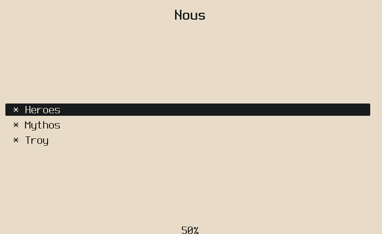
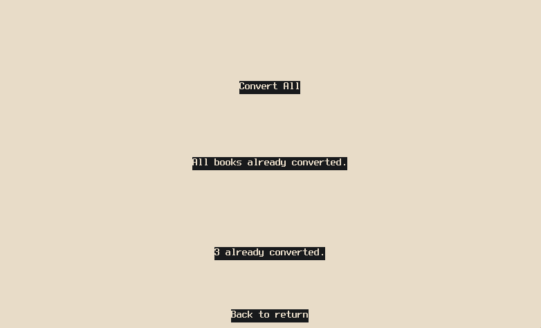
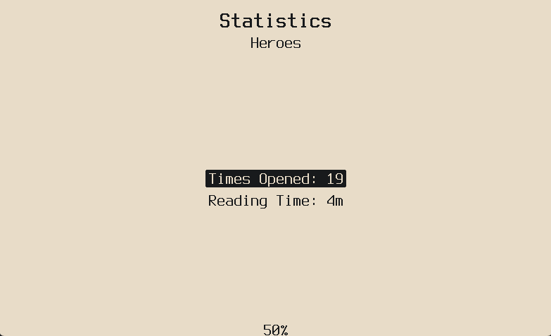
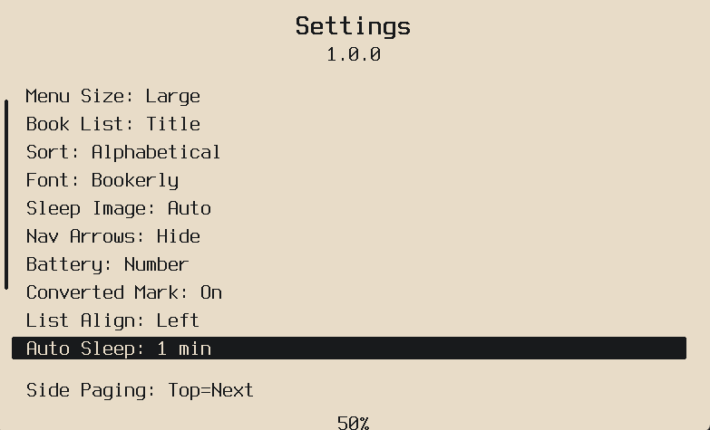
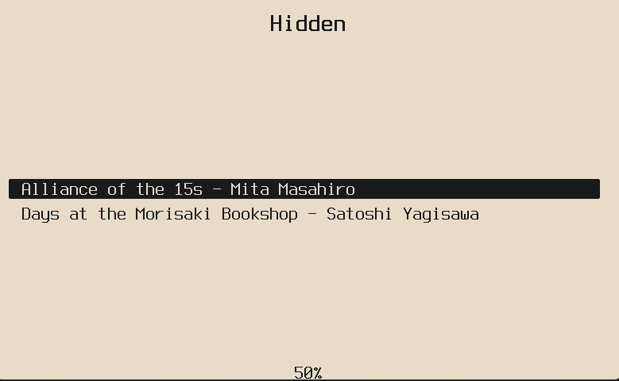
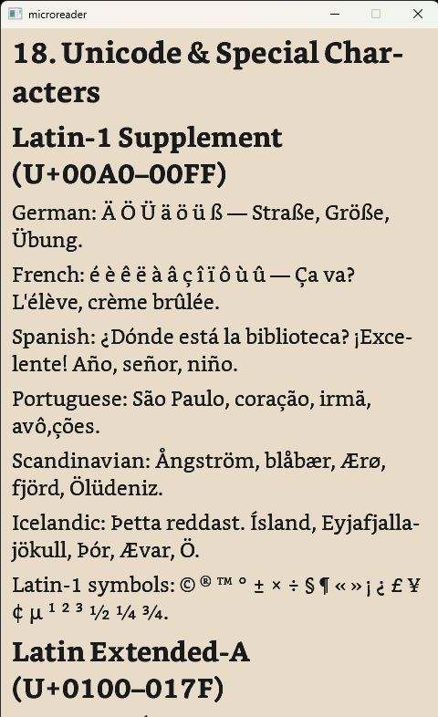
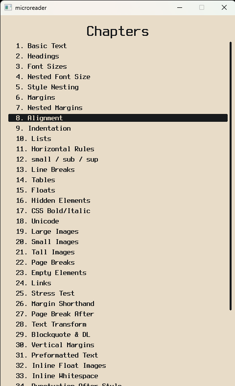
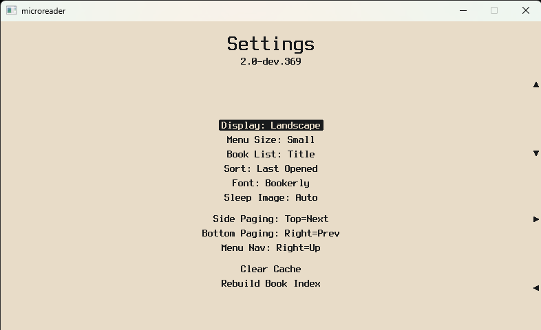

# Nous

A focused EPUB reader firmware for the Xteink X4 e-ink device — built for people who just want to read.

Nous is a personal fork of [microreader](https://github.com/CidVonHighwind/microreader/) by [CidVonHighwind](https://github.com/CidVonHighwind), extended with quality-of-life features that felt missing. The core philosophy stays the same: no Wi-Fi, no sync, no bloat. Only books.

> **v1.0.1** · Based on microreader 2.0-dev · GPL v2

---

## Features

Everything from microreader, plus:

| Feature | Description |
|---|---|
| **Convert All** | Batch-convert every un-converted EPUB in one go from Settings — with per-book progress so you know where it's at |
| **Converted Indicator** | Optional `*` prefix on book titles that are already converted and ready for instant open |
| **Reading Stats** | See how many times you've opened a book and how long you've spent reading it — accessible from Reader Options |
| **Battery Display** | Show battery as an icon, a percentage, or both |
| **List Alignment** | Set book list and menu alignment to left, center, or right — saved across reboots |
| **Hide Nav Arrows** | Clean up the UI by hiding the button hint glyphs |
| **Hidden Books** | Place EPUBs in a `.hidden/` folder at the SD card root — they won't appear in the book list, recents, or auto-reopen on boot. Long-press Back (~3s) on the book list to access them |
| **Auto-Sleep** | Settings → Auto Sleep. Cycles through 1 / 3 / 5 / 10 / 20 / 30 min / Off. Default: 10 min |

**Features**

| Alignment | Convert All | Stats |
|---|---|---|
|  |  |  |

| Auto Sleep | Hidden Books | Reading Options |
|---|---|---|
|  |  |  |

**UI**

| Main Menu | Reader | Chapters |
|---|---|---|
|  |  |  |

| Reader (Landscape) | Settings |
|---|---|
|  |  |

---

## Installation

> [!WARNING]
> **Requires an unlocked Xteink X4.** Do not flash on a locked device.

Grab the latest `.bin` from the [Releases](../../releases) page.

Flash with the [Crosspoint flash tool](https://crosspointreader.com/#flash-tools) (browser-based, nothing to install), or via esptool:

```powershell
python -m esptool --chip esp32c3 --port COM5 --baud 921600 write_flash 0x0 nous.bin
```

Replace `COM5` with your actual port. Hold BOOT while connecting if the device doesn't enter flash mode on its own.

**Before flashing anything**, back up your current firmware:

```powershell
python -m esptool --chip esp32c3 --port COM5 read_flash 0x0 0x1000000 firmware_backup.bin
```

---

## Hidden Books

Place EPUBs in a `.hidden/` folder at the root of your SD card:

```
SD card root/
└── .hidden/
    └── mybook.epub
```

From the book list, long-press the Back button (~3 seconds) and release to open the hidden shelf. Hidden books don't appear in recents and won't reopen automatically on boot.

---

## Changelog

### v1.0.1
- **Hidden Books** — `.hidden/` folder at SD card root; long-press Back on the book list to access
- **Auto-Sleep Timeout** — Settings → Auto Sleep; cycles through 1 / 3 / 5 / 10 / 20 / 30 min / Off; default 10 min
- **Fix** — Reading time in Stats now updates live while a book is open, not only after closing it

---

## Building

### ESP32 Firmware

Requires [PlatformIO](https://platformio.org/). Open in VS Code and click **Build**, or:

```powershell
pio run
```

Output: `.pio\build\esp32c3\firmware.bin`

### Desktop Emulator

Runs the full UI in an SDL2 window — no device needed. Drop `.epub` files in `sd/`.

Requires CMake, Ninja, MinGW, and SDL2.

```powershell
cmake -B build/desktop-debug -G Ninja -DCMAKE_BUILD_TYPE=Debug -DCMAKE_C_COMPILER=gcc -DCMAKE_CXX_COMPILER=g++ "-DCMAKE_POLICY_VERSION_MINIMUM:STRING=3.5" platforms/desktop
cmake --build build/desktop-debug --config Debug
.\build\desktop-debug\microreader_desktop.exe
```

---

## Managing Content

Books (`.epub`) go anywhere on the SD card — scanned recursively from the root. Fonts (`.mfb`) go in `fonts/`. Sleep images go in `.sleep/`.

Copy directly to the SD card, or transfer over USB using the [microreader browser manager](https://cidvonhighwind.github.io/microreader/) (Chrome/Edge/Firefox, Web Serial API) — it works with Nous too.

The [Calibre plugin](tools/calibre-plugin/) from the original microreader also works unchanged.

---

## Firmware Backup & Restore

```powershell
# Backup
python -m esptool --chip esp32c3 --port COM5 read_flash 0x0 0x1000000 firmware_backup.bin

# Restore
python -m esptool --chip esp32c3 --port COM5 write_flash 0x0 firmware_backup.bin

# Switch boot partition if device boots old firmware after flash
python tools/switch_partition.py app0 --port COM5 --flash
```

---

## Project Structure

```
lib/microreader/     shared core (platform-agnostic C++20)
  content/           EPUB parsing, layout, MRB binary format
  display/           Canvas, DisplayQueue, Font interfaces
  screens/           UI screen implementations
platforms/desktop/   SDL2 emulator
platforms/esp32/     ESP-IDF + PlatformIO firmware
test/                Google Test suite
tools/               Python scripts and dev tools
```

---

## Credits

Nous is built on [microreader](https://github.com/CidVonHighwind/microreader/) by [CidVonHighwind](https://github.com/CidVonHighwind). The foundation, the architecture, the MRB conversion system, the rendering engine — all his work. This fork exists because of how well the original was built.

## License

GPL v2 — see [LICENSE](LICENSE).

This project is a fork of microreader and inherits its GPL v2 license. All additions and modifications are released under the same terms.