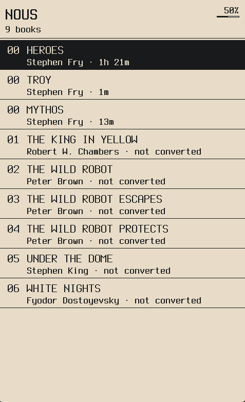
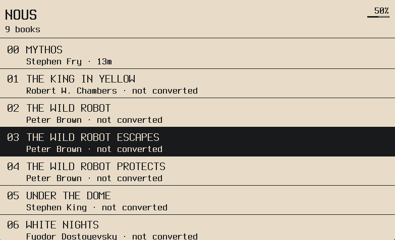
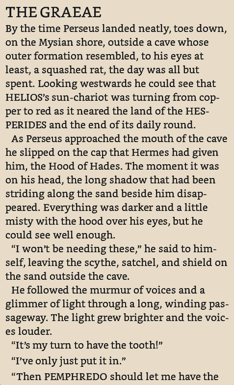
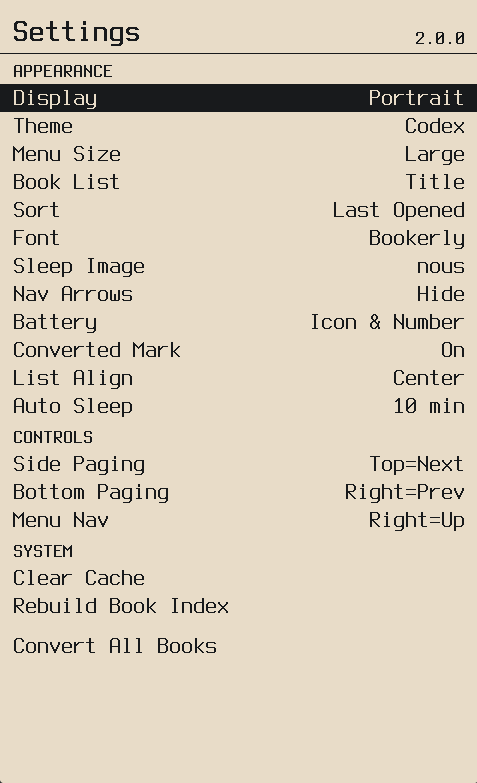
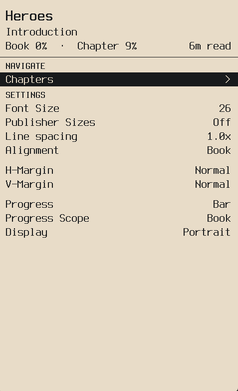
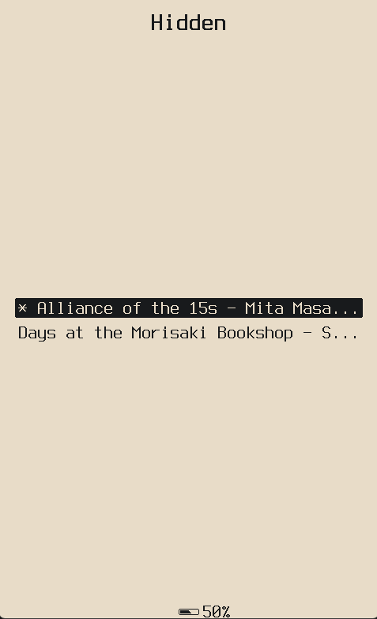
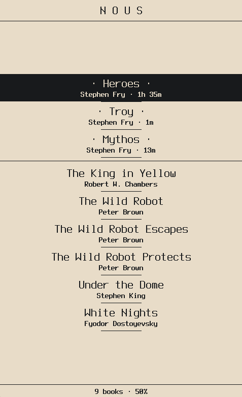
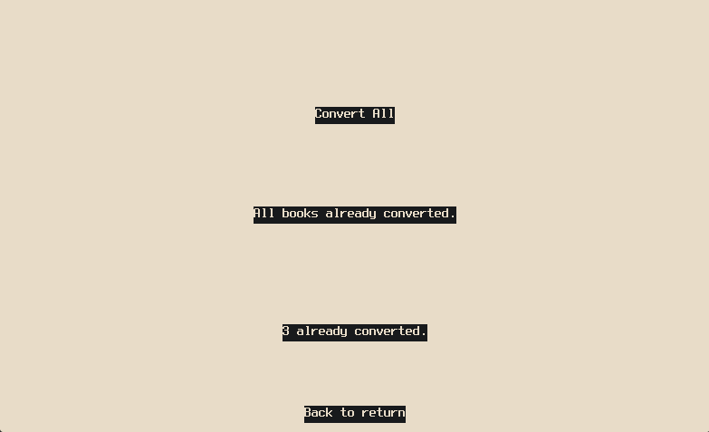

# Nous

Nous is my personal fork of [microreader](https://github.com/CidVonHighwind/microreader/) by [CidVonHighwind](https://github.com/CidVonHighwind) — an open-source EPUB reader firmware for the Xteink X4 e-ink device (ESP32-C3, 800×480).


[📋 Roadmap](https://kan.bn/as1ejm5nnww5/nous) • [☕ Donate](https://ko-fi.com/U7U41U5JQ)

---

---

## Screenshots

| Home | Home (Landscape) | Reader |
|---|---|---|
|  |  |  |

| Settings | Stats | Hidden Books |
|---|---|---|
|  |  |  |

| Stele Theme | Converter |
|---|---|
|  |  |

---

## Features

### Themes

Four visual themes, switchable from Settings:

| Theme | Style |
|---|---|
| **Chronicle** | Clean header bar with battery and button hints at the bottom |
| **Minimal** | Bare list with no decoration — just items |
| **Stele** | Two-line rows with title and author, read time in subtitle |
| **Codex** | Numbered catalog — ALL CAPS titles, author and read time below, 00 for recents |

### Menu

| Feature | Description |
|---|---|
| **Menu Size** | Small / Medium / Large / X-Large — scales all menus and settings |
| **Book Sort** | Alphabetical or Last Opened. Last Opened splits the list into a Recent section above and full library below |
| **Book List Format** | Title only, Title & Author, or Filename |
| **List Alignment** | Left, center, or right — Minimal theme only |

### Library

| Feature | Description |
|---|---|
| **Convert All** | Batch-convert your whole library from Settings — shows per-book progress |
| **Converted Indicator** | Marks already-converted books on the list. Stele uses `·dots·`, Codex shows `· not converted` on unconverted books when enabled |
| **Reading Stats** | Per-book open count and total reading time — visible from the book options screen. Updates live while reading |
| **Hidden Books** | Drop EPUBs into a `.hidden/` folder on the SD card. They won't appear in the list, recents, or auto-open on boot. Long-press Back (~3s) from the book list to access them |

### Display & Controls

| Feature | Description |
|---|---|
| **Battery Display** | Icon only, number only, or both — Chronicle and Minimal themes |
| **Nav Arrows** | Toggle the button hint glyphs in the bottom bar on or off |
| **Display Rotation** | Portrait or Landscape |
| **Auto-Sleep** | Configurable inactivity timeout — 1 / 3 / 5 / 10 / 20 / 30 min, or Off |
| **Sleep Image** | Custom sleep screen from SD card (`.mgr` or `.bmp` in `/.sleep/`), with a selectable Auto Rotate mode |
| **Button Remapping** | Invert menu navigation direction, bottom paging direction, and side button paging direction independently |

### Fonts

| Feature | Description |
|---|---|
| **Custom Reader Fonts** | Load `.mfb` bitmap fonts from `fonts/` on the SD card |
| **Reader Font Size** | Adjustable font size for reading |

---

## Installation

> [!WARNING]
> **Requires an unlocked Xteink X4.** Do not flash on a locked device.

Download the latest `.bin` from the [Releases](../../releases) page.

Flash using the [Crosspoint flash tool](https://crosspointreader.com/#flash-tools) (browser-based, nothing to install), or with esptool:

```powershell
python -m esptool --chip esp32c3 --port COM5 --baud 921600 write_flash 0x0 nous.bin
```

Replace `COM5` with your actual port. Hold BOOT while connecting if the device doesn't enter flash mode automatically.

Back up your existing firmware first:

```powershell
python -m esptool --chip esp32c3 --port COM5 read_flash 0x0 0x1000000 firmware_backup.bin
```

---

## Hidden Books

Create a `.hidden/` folder at the root of your SD card and put EPUBs inside:

```
SD card root/
└── .hidden/
    └── mybook.epub
```

They won't show in the book list, won't appear in recents, and the device won't reopen them on boot. Long-press Back (~3 seconds) from the book list to get to them.

---

## Managing Content

EPUBs go anywhere on the SD card — the device scans recursively from the root.

- **Fonts** — `.mfb` files go in `fonts/`
- **Sleep images** — `.mgr` or `.bmp` files go in `.sleep/`

You can copy files directly to the SD card or transfer over USB. The [microreader browser manager](https://cidvonhighwind.github.io/microreader/) is compatible with Nous.

---

## Building

Requires [PlatformIO](https://platformio.org/). Open in VS Code and hit Build, or from the terminal:

```powershell
pio run
```

Output: `.pio\build\esp32c3\firmware.bin`

### Desktop Emulator

Runs the full UI in an SDL2 window — no device needed. Requires CMake, Ninja, MinGW, and SDL2.

```powershell
cmake -B build/desktop-debug -G Ninja -DCMAKE_BUILD_TYPE=Debug -DCMAKE_C_COMPILER=gcc -DCMAKE_CXX_COMPILER=g++ "-DCMAKE_POLICY_VERSION_MINIMUM:STRING=3.5" platforms/desktop
cmake --build build/desktop-debug --config Debug
.\build\desktop-debug\nous_desktop.exe
```

---

## Project Structure

```
lib/nous/          core library (platform-agnostic C++20)
  content/         EPUB parsing, layout, MRB binary format
  display/         DrawBuffer, font interfaces
  screens/         all UI screen implementations
platforms/esp32/   ESP-IDF + PlatformIO firmware entry point
platforms/desktop/ SDL2 desktop emulator
resources/         embedded assets (sleep image, fonts)
tools/             build scripts
```

---

## Credits

The architecture, MRB conversion system, rendering engine, and the entire foundation this runs on is [CidVonHighwind's](https://github.com/CidVonHighwind) work. I built on top of it.

## License

GPL v2 — see [LICENSE](LICENSE).

Fork of [microreader](https://github.com/CidVonHighwind/microreader/), inheriting its GPL v2 license. All additions in this fork are under the same terms.
