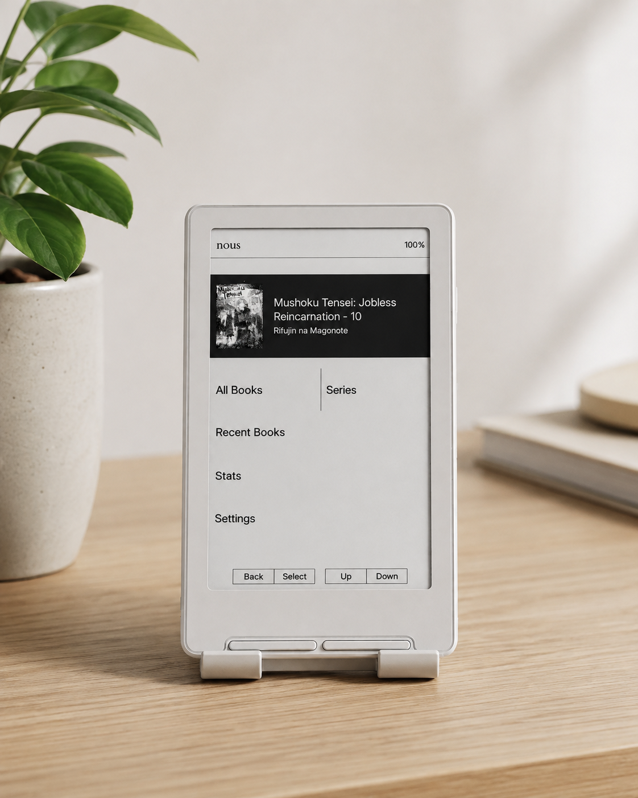

# Nous

Custom firmware for the **Xteink X4**.

  
  
  

  

Nous is a fork of [MicroReader](https://github.com/CidVonHighwind/microreader) for the Xteink X4.

It keeps things simple and fast. No wireless, no accounts, no telemetry. Books live on the SD card, and the library is ready when you turn the device on.

## Install

The easiest way to install Nous is through:

**[nous.reign.fyi](https://nous.reign.fyi/)**

The site includes:

* **[Firmware installer](https://nous.reign.fyi/)** (scroll to the bottom)
* **[Font Converter](https://nous.reign.fyi/fonts)**
* **[Device Manager](https://nous.reign.fyi/manager)**

Firmware releases are also available from the [Releases](https://github.com/unitreign/nous/releases) page.

## Features

### Speed

* Starts up and opens the library in under 1.5 seconds
* No splash screen
* Fast page turns
* Quick book opening
* Display refresh tuned to keep the delay between presses and page changes short

### Library

* Flat library with no folder structure required
* Books can be placed anywhere on the SD card
* Books are indexed automatically
* Natural sorting
* Series View
* Series grouped automatically
* Volumes sorted in the correct order - For example, `Vol. 2` is sorted before `Vol. 10`.
* Finished books moved to the bottom of the library
* Finished books marked with `(fin)`

### Reading

* EPUB support
* Custom fonts
* Adjustable font size
* Custom margins
* Adjustable line spacing
* Reader rotation
* Picks up from the exact page where you left off
* Finished book tracking
* Book Complete dialog
* Reopen finished books from the beginning or continue where you left off
* Per-book reading statistics
* Global reading statistics

### Controls

Front and side buttons can be configured independently for menus and reading.

* Front button direction
* Front reader button direction
* Side button direction
* Side reader button direction
* Configurable power button behaviour

### Statistics

Track reading activity at both the book and global library level.

* Reading time
* Time remaining
* Pages per minute
* Page turns
* Session count
* Average session
* Times opened
* Finished books

### Book Conversion

The **Convert Books** screen in Settings shows the conversion and cover status of every book.

You can:

* Convert individual books
* Generate covers during conversion
* Delete cached conversion data
* Reconvert books
* Convert all unconverted books at once

Large and complex EPUB stylesheets are handled more reliably, avoiding conversion failures caused by large contiguous memory allocations.
> **Note:** EPUBs with unusually large or complex CSS may still cause conversion to stop. If this happens, reboot the device and convert that book individually rather than converting it as part of a batch.

### Fonts

Use the **Font Converter** at [nous.reign.fyi](https://nous.reign.fyi/) to turn a TTF or OTF font into a font pack for Nous.

Load the resulting font onto the device and select it from the reader settings.

### Sleep Screen

* Custom sleep screen image
* Book covers on the sleep screen
* Cover generated during book conversion
* Full-resolution covers on supported themes

### Hidden Shelf

Hold the Back button for three seconds to open a private library.

Books placed in `.hidden` on the SD card appear there instead of in the normal library.

### Sunlight Fading Fix

The optional **Sunlight Fading Fix** powers down the display's analog supply after each refresh.

This helps prevent fading and ghosting when using the X4 in direct sunlight.

It is off by default and adds a short delay when changing pages.

## Details

### Reading first

The library opens quickly and the reader stays out of the way.

Open a book, read, and pick up where you stopped.

### No organisation needed

You do not need to maintain a particular folder structure.

Drop EPUBs anywhere on the SD card. Nous scans the card and builds the library for you.

### Local only

Everything stays on the device and SD card.

There is no cloud library, account, sync service, Wi-Fi, or Bluetooth.

Transfer books and files over USB or directly through the SD card.

### Your fonts

Bring your own TTF or OTF fonts and convert them with the web-based Font Converter.

Typography controls include:

* Font
* Font size
* Margins
* Line spacing

## Stability

Nous includes fixes for damaged books, malformed fonts, SD card errors, and interrupted saves.

This includes:

* Corrupt books being rejected instead of crashing
* Safer handling of corrupt paragraph data
* Atomic book-index saves
* Automatic index backups
* Atomic settings saves
* Bounds checking for malformed font files
* Safer SD card writes
* Safer SD card reads
* Safer navigation to unavailable screens

## System Details

|                  |                                            |
| ---------------- | ------------------------------------------ |
| **Device**       | Xteink X4                                  |
| **Display**      | Monochrome E-Ink · 480 × 800               |
| **Format**       | EPUB                                       |
| **Library**      | Flat scan · Series grouping · Hidden shelf |
| **Typography**   | Font · Size · Margin · Line spacing        |
| **Connectivity** | USB only · No Wi-Fi · No Bluetooth         |
| **License**      | GPL-3.0                                    |

## Before You Flash

**Check the [approved and flagged firmware list](https://brickclub.pages.dev/) before flashing.**

Flashing unapproved firmware can permanently brick your device.

Some international Xteink devices, including many sold through AliExpress, ship with USB flashing disabled. The SD card method can install custom firmware on these locked devices in a few minutes. It does not unlock USB flashing.

If your current firmware does not support SD flashing, use the [OTA Unlocker Tool](https://crosspointreader.com/unlocker).

**Flash at your own risk.** I am not responsible for bricked devices, data loss, or any damage resulting from the use of this firmware or its tools.

## MicroReader

Nous is based on [MicroReader](https://github.com/CidVonHighwind/microreader).

The original project provides the foundation for the reader, book conversion, and Xteink X4 support. Nous extends it with the features and changes listed above.

## License

Nous is licensed under the **GNU General Public License v3.0**.

See [LICENSE](LICENSE) for the full license text.

## Releases

Firmware downloads and release notes are available on the [GitHub Releases](https://github.com/unitreign/nous/releases) page.

The in-device changelog was removed in Nous 2.2.2. Release notes are now published on GitHub.
